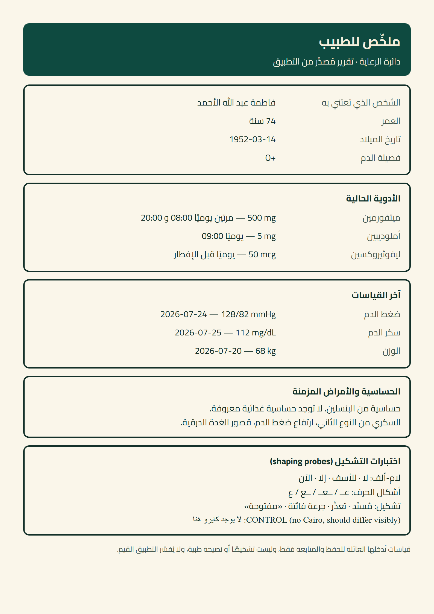

# A4 — PDF font spike: does Cairo actually embed, and does Arabic shape?

**Date:** 2026-07-26 · **Question:** is it safe to spend an EAS rebuild on `expo-print` + `expo-sharing`?
**Answer: yes.** Every decisive risk cleared. One residual risk remains that only a device settles, and it degrades gracefully.



---

## Why a desktop test is a valid proxy

`expo-print` on **Android** renders through `android.webkit.WebView` → `webView.createPrintDocumentAdapter()` → **Chromium's Skia PDF backend**. Desktop headless Chrome's `--print-to-pdf` uses **that same Skia PDF backend and the same HarfBuzz shaper**. So a desktop render exercises the exact code path that produces the Android PDF — the parts that differ are WebView *version* and the print *timing*, both called out under residual risk below.

It is **not** a proxy for iOS, which goes through WKWebView → `UIPrintPageRenderer` → CoreText.

**Method:** built the real HTML shape (two Cairo weights inlined as base64 `@font-face`, `dir="rtl"`, `@page { size: 595pt 842pt; margin: 0 }`, real doctor-summary content), rendered it with **Chrome 150.0.7871.114** headless, then inspected the PDF structure and the visual output.

**Artifacts** (scratchpad, not committed): `spike.html` 249.6 KB · `spike.pdf` 68.1 KB · `spike-full.png` (committed next to this file).

---

## Results

### 1. Cairo embeds. Verified in the PDF structure.

```
BaseFont entries   :
    /BaseFont /AAAAAA+Cairo-Bold
    /BaseFont /BAAAAA+Cairo-Regular
    /BaseFont /CAAAAA+SegoeUI
    /BaseFont /DAAAAA+TimesNewRomanPSMT
embedded programs  : 8   (/FontFile2 = embedded TrueType)
font subtypes      : /Subtype /CIDFontType2, /Subtype /Type0
```

Both weights are present as embedded, **subsetted** CIDFontType2 programs — the `AAAAAA+` / `BAAAAA+` prefixes are the standard subset tags. Corroborating signal: **the 68 KB PDF is smaller than the 246 KB of base64 font that went in**, which is only possible if Chrome parsed the font and kept the glyphs actually used.

`SegoeUI` and `TimesNewRomanPSMT` are the **negative control** doing its job — the spike deliberately includes one line styled `font-family:'DoesNotExist', serif`. It fell back; the Arabic body did not.

### 2. The text is real Unicode, not outlines.

```
ToUnicode maps     : 4
```

Every font has a `/ToUnicode` CMap, so the Arabic is extractable/searchable/copyable text. A doctor can select it; a renderer that lacks the font still knows what the characters are. If Chrome had rasterised or path-filled the text, there would be none.

### 3. Arabic shapes correctly — confirmed visually.

The probe card in the render (bottom of the image above) shows:

| Probe | Result |
|---|---|
| Lam-alef ligature — `لا · للأسف · إلا · الآن` | ✅ forms correctly, including the lam-lam-alef in «للأسف» |
| Contextual forms — `عـ / ـعـ / ـع / ع` | ✅ initial, medial, final and isolated all render distinctly |
| Diacritics — `مُسنَد · تعذّر · جرعة فائتة · «مفتوحة»` | ✅ tashkeel renders and positions |
| Arabic guillemets `«…»` | ✅ |

This was the check that mattered most: `@react-pdf/renderer`'s open issue #3197 is precisely that the lam-alef ligature "may disappear entirely or appear broken … unpredictably". Here it is correct.

> A note on method: I first tried to prove shaping by parsing the PDF's `ToUnicode` CMap for one codepoint mapped to several glyph IDs. That came back "inconclusive" — but the fault was my parser (it read `bfchar` and ignored `bfrange`), not the shaping. The visual render settles it directly, so I did not chase the parser.

### 4. Exactly one page, with room to spare.

```
pages : 1
```

A full doctor summary — identity, three medications with schedules, three vitals with dates, allergies and chronic conditions, a probe card, and the disclaimer — fits one A4 page and clears the bottom margin. `expo/expo#7435` (a phantom trailing page from Android over-counting `contentHeight / pageHeight`) does not bite at this content volume.

### 5. RTL and LTR isolation are correct.

Labels sit right, values left. Every numeric renders LTR inside the Arabic run without reordering: `74 سنة` · `1952-03-14` · `O+` · `500 mg` · `08:00 و 20:00` · `128/82 mmHg` · `2026-07-24`. `unicode-bidi: isolate` behaves exactly as `LtrText`/`isolateLtr` do in the app.

---

## Residual risk — what this does NOT prove

| Risk | Status | Mitigation |
|---|---|---|
| **The font-ready race.** Chrome's `--print-to-pdf` waits for `load`; `expo-print` on Android prints at `onPageFinished`, which is also `load`. Font installation from a `data:` URI is still async relative to it. This is the same mechanism as `expo/expo#29064`. | **Not settled.** No network fetch is involved, which removes the cause in #29064, but not the ordering. | Put the `@font-face` block first in `<head>`; keep the HTML small. If it ever flakes, the failure is **the system Arabic font**, never broken text. |
| **Android WebView version.** crbug 1334127 reported blank normal-weight text in WebView-printed PDFs on specific devices. WebView version is not controlled by the app. | **Not settled** — desktop Chrome 150 is not a device's WebView. | Test on ≥2 physical Android devices before shipping. |
| **iOS.** WKWebView → `UIPrintPageRenderer` → CoreText is a different engine entirely. | **Not tested.** | Test on one iPhone. Note `ios.bundleIdentifier` is still missing, so iOS cannot be built at all yet (A7 §2). |

**The failure mode is benign in every case.** Android and iOS both ship an Arabic system font (Noto Naskh Arabic / Geeza Pro), so the worst realistic outcome is *correct, joined Arabic in the wrong typeface* — never tofu, never disjointed letters. That is what makes this a reasonable bet.

---

## Verdict

**Proceed with the rebuild.** On-device `expo-print` is confirmed to embed Cairo, shape Arabic correctly including the ligature that breaks the server-side alternatives, produce real selectable text, and fit one A4 page. The remaining unknowns are device-specific and degrade to a font substitution, not to a broken document.

Optional last 5%: the throwaway Expo Go check below, on a real Android device and an iPhone. It needs no rebuild — both packages are Expo-Go-supported. **It is a separate throwaway app; it does not mean this project adopts Expo Go.**

```tsx
// App.tsx in a blank `npx create-expo-app` — then `npx expo start` and open in Expo Go.
// npx expo install expo-print expo-sharing @expo-google-fonts/cairo expo-asset expo-file-system
import { useState } from 'react';
import { Button, View } from 'react-native';
import * as Print from 'expo-print';
import * as Sharing from 'expo-sharing';
import { Asset } from 'expo-asset';
import { File } from 'expo-file-system';
import { Cairo_400Regular, Cairo_700Bold } from '@expo-google-fonts/cairo';

export default function App() {
  const [busy, setBusy] = useState(false);
  async function run() {
    setBusy(true);
    const b64 = async (mod: number) => {
      const a = Asset.fromModule(mod);
      await a.downloadAsync();
      return await new File(a.localUri!).base64();
    };
    const [reg, bold] = [await b64(Cairo_400Regular), await b64(Cairo_700Bold)];
    const html = `<!doctype html><html lang="ar" dir="rtl"><head><meta charset="utf-8"><style>
      @font-face{font-family:'Cairo';font-weight:400;src:url(data:font/ttf;base64,${reg}) format('truetype');}
      @font-face{font-family:'Cairo';font-weight:700;src:url(data:font/ttf;base64,${bold}) format('truetype');}
      @page{size:595pt 842pt;margin:0}
      body{font-family:'Cairo',sans-serif;direction:rtl;padding:32pt;font-size:12pt;line-height:1.6}
      .ltr{direction:ltr;unicode-bidi:isolate}
      .control{font-family:'DoesNotExist',serif}
    </style></head><body>
      <h1 style="font-weight:700">ملخّص للطبيب</h1>
      <p>لام-ألف: لا · للأسف · إلا · الآن</p>
      <p>أشكال الحرف: عـ / ـعـ / ـع / ع</p>
      <p>تشكيل: مُسنَد · تعذّر · جرعة فائتة</p>
      <p>ضغط الدم <span class="ltr">128/82 mmHg</span> — <span class="ltr">2026-07-24</span></p>
      <p class="control">CONTROL (no Cairo): لا يوجد كايرو هنا</p>
    </body></html>`;
    const { uri } = await Print.printToFileAsync({ html, width: 595, height: 842 });
    if (await Sharing.isAvailableAsync()) {
      await Sharing.shareAsync(uri, { mimeType: 'application/pdf', UTI: 'com.adobe.pdf' });
    }
    setBusy(false);
  }
  return (
    <View style={{ flex: 1, justifyContent: 'center', padding: 24 }}>
      <Button title={busy ? '…' : 'Generate PDF'} onPress={run} disabled={busy} />
    </View>
  );
}
```

**What to check on the device PDF:** (a) do the letters join, (b) is it Cairo or the system Arabic — the CONTROL line is your reference for what a fallback looks like, (c) is it exactly one page, (d) does the Arabic select/copy out as real text.

**Never set `useMarkupFormatter: true`** — it bypasses the WebView entirely, drops images, and will not honour `@font-face`.
